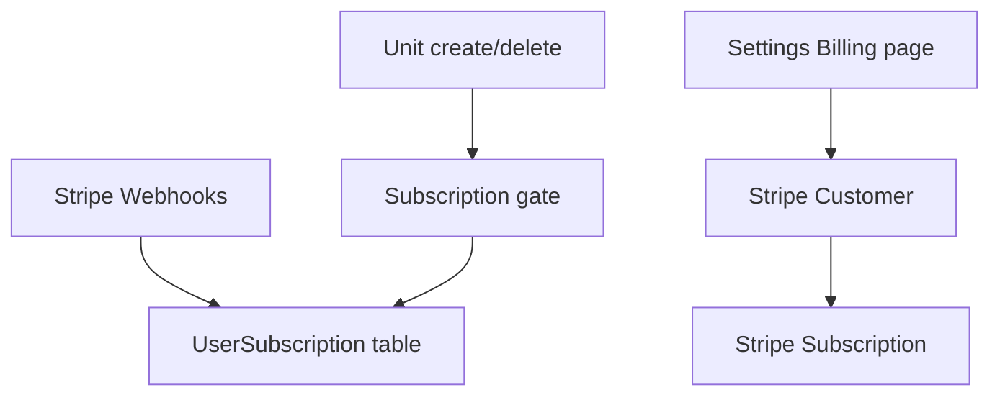

# Auth & Monetization

Google sign-in and unit-based subscription pricing for **hosted cloud** deploy. Local desktop install remains free.

**Phase:** 3 — see [phases.md](./phases.md)

---

## Google sign-in

### Current state

- Email + password only (`src/app/actions/auth.ts`)
- `User.password` required in schema
- HMAC session cookie `landlord_session` (`src/lib/session-token.ts`)
- No OAuth tables or Google client IDs
- `assertCloudDataAllowed()` blocks auth on local-only marketing deploy

### Schema changes

```prisma
model User {
  id        String   @id @default(cuid())
  email     String   @unique
  password  String?  // null for OAuth-only users
  name      String?
  image     String?  // from Google profile
  accounts  Account[]
}

model Account {
  id                String @id @default(cuid())
  userId            String
  provider          String // "google"
  providerAccountId String // Google sub
  accessToken       String?
  refreshToken      String?
  expiresAt         Int?

  @@unique([provider, providerAccountId])
}
```

### Implementation approach

Use **Auth.js (NextAuth v5)** for the Google OAuth flow on web. On success, call existing `setSession(userId)` so middleware and Server Actions keep working unchanged.

### Account linking

| Scenario | Behavior |
|----------|----------|
| New Google user | Create `User` + `Account` + default `UserSettings` |
| Google email matches existing password user | Link after optional password confirm |
| OAuth-only user wants password | "Set password" in Settings |

### Environment

```text
GOOGLE_CLIENT_ID=
GOOGLE_CLIENT_SECRET=
AUTH_SECRET=          # align with or separate from SESSION_SECRET
AUTH_URL=             # production domain
```

### Security

- Verify `email_verified` from Google
- Use Google `sub` as stable `providerAccountId`
- Rate-limit auth endpoints

### Mobile (Phase 4)

- Expo: `expo-auth-session` or `@react-native-google-signin/google-signin`
- App sends ID token → `POST /api/v1/auth/google` → server verifies → returns Bearer token
- Never embed client secret in the app

### Apple Sign-In

Required when shipping Google login on iOS App Store. Plan for Phase 4 native, not necessarily web-only Phase 3.

### Phasing

| Step | Scope |
|------|--------|
| G1 | Schema + Google on web |
| G2 | Account linking + set password |
| G3 | `/api/v1/auth/google` for Expo |
| G4 | Apple Sign-In for iOS |

---

## Unit-based subscription

### Pricing model (monthly CAD)

| Units | Calculation | Monthly total |
|-------|-------------|---------------|
| 1 | 1 × $1 | $1 |
| 5 | 5 × $1 | $5 |
| 10 | 10 × $1 | $10 |
| 11 | 10 × $1 + 1 × $2 | $12 |
| 15 | 10 × $1 + 5 × $2 | $20 |
| 25 | 10 × $1 + 15 × $2 | $40 |

**Rule:** $1/unit for units 1–10; $2/unit for each unit above 10.

```ts
function monthlySubscriptionCents(unitCount: number): number {
  const n = Math.max(0, unitCount);
  if (n <= 10) return n * 100;
  return 10 * 100 + (n - 10) * 200;
}
```

### Product rules

| Decision | Recommendation |
|----------|----------------|
| What counts as a unit | All units in portfolio (not only occupied) |
| Currency | CAD (matches tenant Stripe checkout) |
| Billing period | Monthly |
| Local install | **Free**, unlimited units |
| Hosted cloud | Subscription after trial |
| Add unit #11 mid-cycle | Stripe proration; confirm before create |
| Delete unit | Prorate or credit next invoice |
| Past due | Grace (7 days) → read-only → block new statements |
| Free trial | 14–30 days recommended |

### Marketing tagline

> $1 per unit for your first 10 units, then $2 per unit — simple pricing that grows with your portfolio.

### Architecture



**Two Stripe use cases (same Stripe account):**

| Flow | Mode | Purpose |
|------|------|---------|
| Tenant pays rent | Checkout `payment` | Existing |
| Landlord pays Zigglo | Billing `subscription` | New |

### Schema

```prisma
model UserSubscription {
  id                   String    @id @default(cuid())
  userId               String    @unique
  stripeCustomerId     String?   @unique
  stripeSubscriptionId String?   @unique
  status               String    // trialing | active | past_due | canceled | incomplete
  currentPeriodEnd     DateTime?
  trialEndsAt          DateTime?
  canceledAt           DateTime?
  unitCountAtSync      Int       @default(0)
  user                 User      @relation(...)
}
```

Optional: `UserSettings.subscriptionExempt` for demo/internal accounts.

### Stripe implementation (recommended v1)

**Two subscription items** (clearest to audit):

- Item 1: quantity = `min(units, 10)` @ $1.00 CAD/unit/month
- Item 2: quantity = `max(units - 10, 0)` @ $2.00 CAD/unit/month

Sync on unit create/delete + daily cron.

Alternative: single Stripe Price with graduated tiers (fewer line items, harder to debug).

### Code layout

```text
src/lib/subscription/
  pricing.ts
  unit-count.ts
  sync-stripe.ts
  gate.ts
src/app/api/stripe/
  subscription-checkout/route.ts
  webhook/route.ts          # extend existing
src/app/(dashboard)/settings/billing/page.tsx
```

### Gate behavior

- Block `createUnitAction` if `past_due` (with upgrade CTA)
- Allow view existing data when lapsed; block generate/send statements
- Dashboard banner when trial ending

### Webhooks to handle

Extend `src/app/api/stripe/webhook/route.ts`:

- `customer.subscription.created` / `updated` / `deleted`
- `invoice.paid` / `invoice.payment_failed`
- `checkout.session.completed` (if Checkout for first subscribe)

### UI surfaces

| Surface | Content |
|---------|---------|
| Settings → Billing | Plan, unit count, monthly total, tier breakdown |
| Marketing pricing | Calculator widget |
| Add unit flow | Price change when crossing 10 units |
| Onboarding | Trial → subscribe before heavy use |

### Compliance

- GST/HST on SaaS if required (Stripe Tax or manual)
- Stripe Customer Portal for invoices

### Phasing

| Step | Scope |
|------|--------|
| S1 | `pricing.ts` + billing page (display only) |
| S2 | Stripe Customer + Subscription + Checkout/Portal |
| S3 | Unit gate + quantity sync + proration |
| S4 | Trial, dunning, past-due enforcement |
| S5 | In-app invoices; tax if required |

### Cost reference

| Units | Monthly |
|-------|---------|
| 3 | $3 |
| 10 | $10 |
| 12 | $12 |
| 20 | $30 |
| 50 | $90 |
