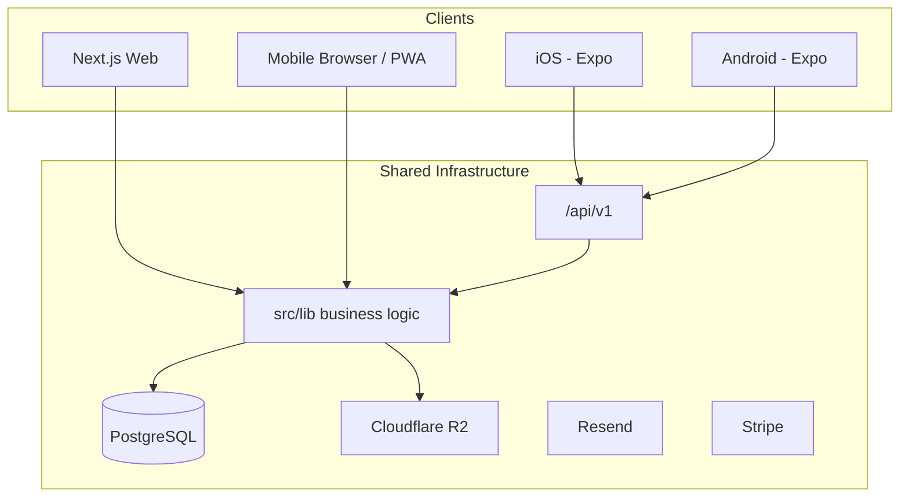

# Mobile Platform Strategy

Web, PWA, REST API, and native iOS/Android — one backend, shared database and infrastructure.

**Phases:** Phase 1 (mobile web), Phase 4 (native + API) — see [phases.md](./phases.md)

---

## Current state

| Area | Status |
|------|--------|
| Responsive layout | Partial — grids, hamburger nav (`AppHeader`), `lg:hidden` header |
| PWA | manifest (`src/app/manifest.ts`), service worker (`public/sw.js`), `PwaRegister` |
| Viewport | `device-width`, `viewportFit: cover`, apple-web-app meta |
| Server Actions | All mutations — **native apps cannot use these directly** |
| Auth | HMAC cookie `landlord_session` — works in mobile browser, not native without Bearer |
| Tenant pay page | `/pay/[token]` — already mobile-friendly |

---

## Target architecture

One backend, three clients:



**Principle:** Web keeps Server Actions. Mobile apps use **`/api/v1` only**, calling the same `src/lib/*` functions.

---

## Track A — Mobile web (Phase 1)

**Timeline:** 4–6 weeks  
**Goal:** Full landlord workflow usable on iPhone/Android browser.

### Tasks

- [ ] Audit every dashboard route at 375px width
- [ ] Tables → cards on `sm` breakpoints (statements, payments, tenants, bills)
- [ ] Touch targets ≥ 44×44px on primary actions
- [ ] Camera capture: `accept="image/*" capture="environment"` for bills and maintenance
- [ ] PWA: install prompt UX, splash screens, apple-touch-icon sizes
- [ ] Optional bottom nav (Home, Properties, Billing, Documents, More)
- [ ] Safe areas for notched devices

### Defer on mobile web

- xlsx spreadsheet import
- T776 export
- Lease wizard / DocuSign
- Bulk statement generation (simplify to link to desktop)

### Success

Demo account usable end-to-end on iPhone Safari without horizontal scroll.

---

## Track B — API layer (Phase 4 prerequisite)

**Timeline:** 6–8 weeks  
**Goal:** Native apps can authenticate and perform core mutations.

### Proposed routes

```text
src/app/api/v1/
  auth/
    login/          POST → Bearer session token
    logout/
    me/
    google/         POST → verify Google ID token (Phase 3)
  dashboard/        GET → hero KPIs
  properties/...
  statements/...
  payments/...
  maintenance/...
  documents/        GET + presigned upload URLs
```

Each route:

1. Validates input (`src/lib/validation.ts`)
2. `parseSessionToken` from `Authorization: Bearer <token>`
3. Ownership helpers (`requireProperty`, `requireUnit`, etc.)
4. Delegates to `src/lib/*`

### Refactor pattern

```ts
// src/lib/statements.ts — business logic (exists)
export async function recordStatementPayment(...) { ... }

// src/app/actions/statements.ts — web wrapper
export async function recordStatementPaymentAction(formData) { ... }

// src/app/api/v1/statements/[id]/payments/route.ts — mobile
export async function POST(req) { ... }
```

### Auth for mobile

| Approach | MVP | v2 |
|----------|-----|-----|
| Bearer HMAC token | Reuse `userId.signature` (30-day, same as cookie) | JWT access + refresh |
| Google on mobile | `POST /api/v1/auth/google` | + Apple Sign-In |

### Files on mobile

Requires R2 (Phase 0):

- `POST /api/v1/uploads/presign` → client uploads to R2
- `GET /api/v1/documents/:id/url` → short-lived download URL

---

## Track C — Native apps with Expo (Phase 4)

**Timeline:** 8–10 weeks to MVP  
**Why Expo:** Same TypeScript stack, one codebase for iOS + Android, SecureStore, camera, deep links.

### Alternatives (not recommended for v1)

| Option | Verdict |
|--------|---------|
| Capacitor (wrap Next.js) | Poor fit — Server Actions need server; feels like browser tab |
| Flutter | Duplicate UI and types |
| PWA only | May be enough if Track A is excellent |

### Repo layout (future)

```text
apps/
  web/          # current Next.js (or repo root)
  mobile/       # Expo
packages/
  shared/       # API types, validation, formatMoney, constants
```

### Native MVP screens (landlord companion app)

| Priority | Screen |
|----------|--------|
| P0 | Sign in / sign out |
| P0 | Dashboard (overdue, KPIs) |
| P0 | Properties list + unit detail |
| P0 | Statement detail + record payment |
| P1 | Payments list |
| P1 | Maintenance list + photo upload |
| P2 | Send statement (confirm) |
| P2 | Push: overdue alert |
| P3 | Generate statements, utility import — web-first |

### Out of native v1

- Spreadsheet import
- Tax reports
- Lease wizard
- DocuSign
- Bulk statement generation

### Tenant native app

Not in scope. Pay links work in mobile browser; tenant portal is Phase 3 web.

### Distribution

- iOS: TestFlight → App Store (Apple Sign-In likely required with Google)
- Android: Google Play internal track
- Deep links: `zigglo://` + universal links for `/pay/[token]`

### Environment

```text
EXPO_PUBLIC_API_URL=https://app.zigglo.com
```

Native apps never connect to the database directly.

---

## Local dev note

Physical devices cannot reach `localhost`. Use ngrok or a staging URL for API testing.

---

## Effort estimates

| Track | Solo dev | Team of 2 |
|-------|----------|-----------|
| Mobile web polish | 4–6 weeks | 2–3 weeks |
| API layer | 6–8 weeks | 4–5 weeks |
| Expo MVP | 8–10 weeks | 6–8 weeks |
| **App Store MVP total** | ~5–6 months | ~3–4 months |

Parallelize: mobile web + API design while API is built; Expo starts when auth + dashboard API exists.
