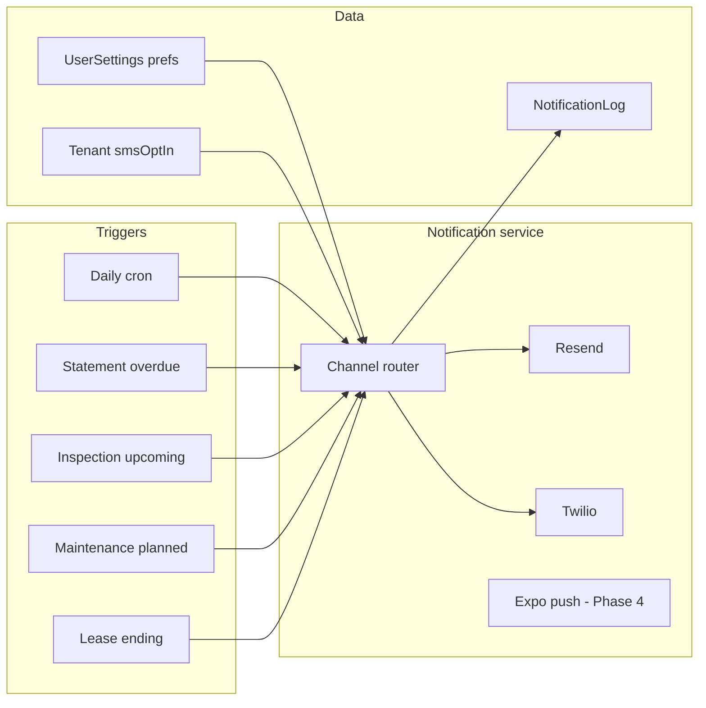

# Notifications & Reminders

SMS and email reminders for overdue rent, inspections, maintenance, and lease events. Part of Phase 3 smart reminders.

---

## Current state

| Piece | Status |
|-------|--------|
| `Tenant.phone` | Optional on tenant records |
| Overdue rent | `syncOverdueStatements()` updates status — **no outbound notification** |
| Lease reminders | `getLeasesEndingSoon()` — dashboard only |
| Inspections | `inspectionDate` — no future `scheduledFor` field yet |
| Maintenance | `maintenanceDate` + `status: planned` — no notifier |
| Email | `src/server/emails/send.ts` — dev stub; Resend in production plan |
| SMS | Not implemented |
| Cron | `/api/cron/auto-billing` — statements only |

---

## Notification architecture



### Code layout

```text
src/server/notifications/
  send.ts              # route by channel: email | sms
  templates/           # overdue, inspection, maintenance, lease-end
  sms/twilio.ts
src/lib/reminders/
  overdue-rent.ts
  inspection-upcoming.ts
  maintenance-upcoming.ts
  lease-ending.ts
```

---

## Schema additions

```prisma
model NotificationLog {
  id         String   @id @default(cuid())
  userId     String
  channel    String   // email | sms
  type       String   // overdue_rent | inspection_reminder | ...
  recipient  String
  entityType String?
  entityId   String?
  sentAt     DateTime @default(now())
  providerId String?
  status     String   // sent | failed | skipped
}

// Extend UserSettings
  smsRemindersEnabled      Boolean @default(false)
  smsOverdueReminders      Boolean @default(true)
  smsInspectionReminders   Boolean @default(true)
  smsMaintenanceReminders  Boolean @default(true)
  landlordPhone            String?
  overdueReminderDays      Int     @default(3)
  inspectionReminderDays   Int     @default(1)
  maintenanceReminderDays  Int     @default(1)

// Extend Tenant
  smsOptIn       Boolean   @default(false)
  smsOptInAt     DateTime?
  smsOptInSource String?
```

---

## Reminder types

| Type | Recipient | When | Message |
|------|-----------|------|---------|
| **Overdue rent** | Tenant; optional landlord copy | X days after `Statement.dueDate` while overdue/partial | Amount + `/pay/[payToken]` |
| **Rent due soon** (optional) | Tenant | 3 days before due | Nudge + pay link |
| **Inspection** | Tenant + landlord | N days before `scheduledFor` | Date, unit, address |
| **Maintenance** | Tenant (if unit) + landlord | N days before `maintenanceDate` when `planned` | Vendor/date if known |
| **Lease ending** | Landlord | Per `leaseReminderDays` | Dashboard + outbound email/SMS |

### Prerequisites

- **Inspection:** add `scheduledFor` (Phase 2.12) before inspection SMS
- **Overdue:** `dueDate`, `payToken`, overdue sync already exist — fastest win
- **Resend** for email parity (Phase 0)

---

## Cron

New or extended job (same `CRON_SECRET` pattern):

```text
POST /api/cron/reminders
  → syncOverdueStatements (all users)
  → send overdue notifications (dedupe via NotificationLog)
  → inspection reminders
  → maintenance reminders
  → lease-ending reminders
```

Run daily (e.g. 9:00 AM; add landlord timezone on `UserSettings` later).

---

## SMS provider

**Twilio** (recommended for Canada/US):

```text
TWILIO_ACCOUNT_SID=
TWILIO_AUTH_TOKEN=
TWILIO_FROM_NUMBER=   # or Messaging Service SID
```

- Cost: ~$0.01–0.02 CAD per segment
- Resend is email-only — keep channels parallel behind one router

---

## CASL compliance (Canada)

SMS is a commercial electronic message under **CASL**:

- [ ] Express consent before texting tenants (`smsOptIn` + timestamp)
- [ ] Capture consent in lease wizard / tenant form
- [ ] Identify sender in every message
- [ ] Include unsubscribe ("Reply STOP to opt out")
- [ ] Honor STOP permanently
- [ ] Log consent source for audit

Rent and inspection reminders to consented tenants are lower risk than marketing, but **document consent** anyway.

---

## UI work

- [ ] Settings → Notifications: toggles, landlord phone, lead times
- [ ] Tenant form: phone + SMS opt-in checkbox
- [ ] Optional notification log on statement or settings
- [ ] Manual "Send SMS reminder" on overdue statement (N1 proof of pipeline)

---

## Phasing

| Step | Scope |
|------|--------|
| N1 | `NotificationLog` + Twilio adapter + manual send on statement |
| N2 | Overdue auto-SMS/email via cron + pay link |
| N3 | Inspection reminders (after `scheduledFor`) |
| N4 | Maintenance planned-date reminders |
| N5 | Rent-due-soon + lease-end SMS; landlord copies |
| N6 | Push notifications via Expo (Phase 4) |

### Dependencies

- Phase 0: Resend, production hosting
- Phase 2: `scheduledFor` on inspections
- Phase 3: landlord notification settings UI

---

## Integration with product strategy

Maps to strategy **Priority 3 — Smart reminders**:

- Insurance expires → Phase 4
- Lease expires → N5 / existing dashboard
- Utilities missing → billing readiness warnings (Phase 4.10)
- Rent overdue → N2 (highest priority)
