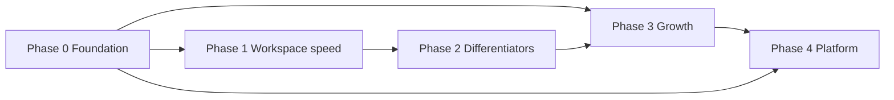

# Phased Roadmap

Master delivery plan integrating product strategy, infrastructure, mobile, monetization, notifications, and UX. Each phase has exit criteria before moving on.

**Index:** [README](./README.md)

---

## Phase 0 — Production foundation

**Timeline:** Weeks 1–4  
**Goal:** Hosted Zigglo is reliable enough for daily landlord use.

### Tasks

- [ ] **0.1** PostgreSQL in production (Neon) — see [production-plan.md](../../production-plan.md)
- [ ] **0.2** File storage: local filesystem → Cloudflare R2
- [ ] **0.3** Email: console stub → Resend (`src/server/emails/send.ts`)
- [ ] **0.4** Production `SESSION_SECRET` and `NEXT_PUBLIC_APP_URL`
- [ ] **0.5** Stripe webhooks verified in production
- [ ] **0.6** Cron secured with `CRON_SECRET` for auto-billing
- [ ] **0.7** Clarify hosted cloud vs local install (`isLocalDataOnlyDeploy`) — subscription/OAuth apply to cloud only

### Exit criteria

- Deploy survives restart without losing uploads
- Statements and receipts send real email in staging
- Demo account works on production URL

### Dependencies

None — blocks all customer-facing growth work.

---

## Phase 1 — Workspace speed

**Timeline:** Weeks 4–10  
**Goal:** Hit success metrics for find/upload/generate on desktop and mobile browser.

Aligns with strategy Priority 1 gaps and UX success metrics.

### Tasks

#### Document vault & search

- [x] **1.1** Global search (⌘K) — documents, tenants, properties, statements
- [x] **1.2** Property document hub — folder view per property (leases, bills, insurance, tax, photos)
- [x] **1.3** Document tags UI — use existing `Document.tags` field
- [x] **1.4** Filename + category filters polish on `/documents` (incl. tag filter)

#### Utility signature feature

- [x] **1.5** Utility profiles — save/apply presets (60/40, equal split, basement/main)
- [ ] **1.6** Billing workflow polish — blocked units, split preview clarity

#### Dashboard & navigation

- [x] **1.7** Dashboard action focus — upcoming tasks, recent uploads, property cards
- [x] **1.8** Per-property quick status on dashboard (occupancy, overdue, open maintenance)

#### Mobile web (not secondary)

- [ ] **1.9** Responsive audit at 375px — tables → cards on billing, statements, tenants
- [ ] **1.10** Camera upload for bills and maintenance receipts
- [ ] **1.11** PWA install UX + iOS splash/icons
- [ ] **1.12** Optional bottom nav for top destinations on mobile

#### Motion (light polish)

- [x] **1.13** Motion tokens + `prefers-reduced-motion` — see [ux-and-animation.md](./ux-and-animation.md)
- [ ] **1.14** Skeleton loaders on dashboard, statements, properties
- [ ] **1.15** Mobile nav slide; flash alert enter/exit

### Exit criteria

| Metric | Target |
|--------|--------|
| Find lease | < 10 seconds (with search) |
| Upload utility bill | < 30 seconds on phone |
| Generate statements | < 1 minute (bills present) |
| Mobile billing path | Usable without horizontal scroll |

### Dependencies

Phase 0 for production testing; R2 helps mobile uploads.

---

## Phase 2 — Differentiators

**Timeline:** Weeks 10–18  
**Goal:** Features RentRedi doesn't emphasize; strengthen Ontario wedge.

### Tasks

#### Property timeline (P2 — high value)

- [ ] **2.1** Property timeline MVP — lease events, bills uploaded, maintenance completed, inspections, notices sent
- [ ] **2.2** Timeline on property detail page
- [ ] **2.3** Maintenance chronological view (resale / audit story)

#### Property health & expenses

- [ ] **2.4** Property health card — occupancy, overdue $, open maintenance, missing utilities
- [ ] **2.5** Simple expense rollup — yearly totals (maintenance + utilities + property tax/insurance fields)
- [ ] **2.6** No full GL — export-friendly summaries only

#### Statements & documents

- [ ] **2.7** Statement PDF template refresh — landlord branding, professional layout
- [ ] **2.8** Recurring monthly charges — parking, storage, internet as unit-level line items
- [ ] **2.9** Auto-categorization heuristics on upload (filename/vendor patterns; not full OCR)

#### Ontario toolkit

- [ ] **2.10** Package existing LTB notices as marketed "Ontario Landlord Toolkit"
- [ ] **2.11** Expand N-series library and notice wizard polish

#### Inspections (support later reminders)

- [ ] **2.12** `scheduledFor` on inspections (future appointment vs completed record)

### Exit criteria

| Metric | Target |
|--------|--------|
| Property status | < 5 seconds from property card |
| Find maintenance | < 15 seconds via timeline or property tab |
| Differentiation | Timeline demoable in sales/onboarding |

### Dependencies

Phase 1 search/hub makes timeline more valuable.

---

## Phase 3 — Growth & retention

**Timeline:** Weeks 18–28  
**Goal:** Monetize hosted product, reduce friction, automate reminders, minimal tenant portal.

### Tasks

#### Monetization

- [ ] **3.1** Subscription pricing logic — see [auth-and-monetization.md](./auth-and-monetization.md)
- [ ] **3.2** `UserSubscription` schema + Stripe Customer/Billing
- [ ] **3.3** Settings → Billing page (unit count, tier breakdown, portal link)
- [ ] **3.4** Unit-create gate + quantity sync (proration)
- [ ] **3.5** Free trial (14–30 days or similar)
- [ ] **3.6** Past-due enforcement (grace → read-only → block new statements)

#### Auth

- [ ] **3.7** Google sign-in on web (Auth.js or equivalent)
- [ ] **3.8** Account linking (Google email matches existing password user)
- [ ] **3.9** `POST /api/v1/auth/google` for future native apps

#### Notifications

- [ ] **3.10** Notification service abstraction — see [notifications.md](./notifications.md)
- [ ] **3.11** Overdue rent SMS/email (cron + pay link)
- [ ] **3.12** Lease-ending reminders (outbound, not dashboard-only)
- [ ] **3.13** Inspection + maintenance reminders (after `scheduledFor`)
- [ ] **3.14** Landlord notification preferences in Settings

#### Tenant portal (minimal)

- [ ] **3.15** Tenant auth via magic link or pay-token scope
- [ ] **3.16** Download statements
- [ ] **3.17** Submit maintenance request
- [ ] **3.18** Upload document (optional)
- [ ] **3.19** No payment required in portal (existing pay link remains)

#### UX polish

- [ ] **3.20** Billing workflow step animations
- [ ] **3.21** KPI count-up on dashboard (optional)

### Exit criteria

- Hosted signup → trial → subscribe flow works end-to-end
- Overdue tenant receives SMS with pay link (with opt-in)
- Google sign-in works on web
- One beta tenant uses portal for statement download

### Dependencies

Phase 0 (Resend, Stripe); Phase 2 `scheduledFor` for inspection SMS.

---

## Phase 4 — Platform expansion

**Timeline:** Month 7+  
**Goal:** Native apps and intelligent automation — only with paying users and clear demand.

### Tasks

#### API & native mobile

- [ ] **4.1** Bearer auth middleware (`Authorization` header + existing HMAC token)
- [ ] **4.2** `/api/v1` REST — auth, dashboard, properties, statements, payments, maintenance, documents
- [ ] **4.3** OpenAPI or typed client for mobile
- [ ] **4.4** Expo app MVP — sign in, dashboard, properties, statement detail, record payment
- [ ] **4.5** SecureStore for token; TestFlight + Android internal track
- [ ] **4.6** Apple Sign-In (required if Google on iOS App Store)
- [ ] **4.7** Push notifications (overdue, optional) via Expo Push

See [mobile.md](./mobile.md) for full detail.

#### Intelligent automation

- [ ] **4.8** OCR utility bill extraction (PDF → amount, vendor, period)
- [ ] **4.9** Insurance expiry reminders
- [ ] **4.10** Missing utility bill warnings (proactive SMS/email)

#### Integrations (demand-gated)

- [ ] **4.11** QuickBooks export (not full accounting)
- [ ] **4.12** Screening / listings — **only if repeated customer demand**

#### Explicitly defer

- [ ] ~~Full accounting~~
- [ ] ~~Tenant screening v1~~
- [ ] ~~Multi-user teams~~
- [ ] ~~Enterprise features~~

### Exit criteria

- App Store / Play internal beta with 5–10 landlords
- API covers companion-app workflows (read + quick actions)
- OCR reduces manual bill entry time measurably in user tests

### Dependencies

Phase 3 subscription + auth; Phase 0 R2 for presigned mobile uploads.

---

## 90-day focus (compressed)

If scope must stay tight, execute in this order:

1. Phase 0 — production deploy  
2. Phase 1.1–1.2 — search + property document hub  
3. Phase 1.5–1.6 — utility profiles + billing polish  
4. Phase 2.1 — property timeline MVP  
5. Phase 1.9–1.10 — mobile web upload  

Defer Phase 3+ until first paying hosted users.

---

## Phase dependency diagram

---

## Document map by phase

| Phase | Primary docs |
|-------|----------------|
| 0 | [production-plan.md](../../production-plan.md) |
| 1 | [product-strategy.md](./product-strategy.md), [ux-and-animation.md](./ux-and-animation.md) |
| 2 | [product-strategy.md](./product-strategy.md), [implementation-status.md](./implementation-status.md) |
| 3 | [auth-and-monetization.md](./auth-and-monetization.md), [notifications.md](./notifications.md) |
| 4 | [mobile.md](./mobile.md) |
